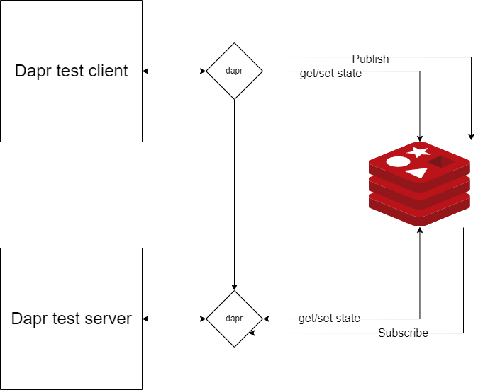

# Dapr Demo
-------
Demo repo to showcase some dapr functionality 
more information can be found on : https://dapr.io/

## Resources:
* Dapr docs: `https://docs.dapr.io/`
* .NET docs: `https://docs.microsoft.com/en-us/dotnet/architecture/dapr-for-net-developers/`
* eShopOnDapr: `https://github.com/dotnet-architecture/eShopOnDapr`

## Quick Installation Guide

* Install Dapr Cli
    `https://docs.dapr.io/getting-started/install-dapr-cli/`
   
* Dapr init

   Run 
   
   ```
   dapr init
   ```
   
 * Dapr debug sidecar
    
    Run the sidecar for the `daprtestclient`:
    
    ```
     daprd --app-id daprtestclient --components-path ../components/  --metrics-port 9091
    ```
    
        
    Run the sidecar for the `daprtestserver`:
    
    ```
     daprd --app-id daprtestserver --components-path ../components/ --app-port 5008 --dapr-grpc-port 50002 --dapr-http-port 3501
    ```
    You can now after following the above steps rung the services in debug mode.
    ### Docker version

    * Naviate to the root project directory
    * Run `docker-compose up -d`


    Taking services down:
      Run `docker-compose down`


## Service flow

### redis
  * daprtestclient[GetWeatherForecast] -> dapr ->  redis -> dapr -> daprtestserver[weatherforecast]
  * daprtestclient[PostWeatherForecast] -> dapr ->redis
  * daprtestclient[PublishWeatherForecast] -> ->redis -> dapr -> daprtestserver[forecast]



